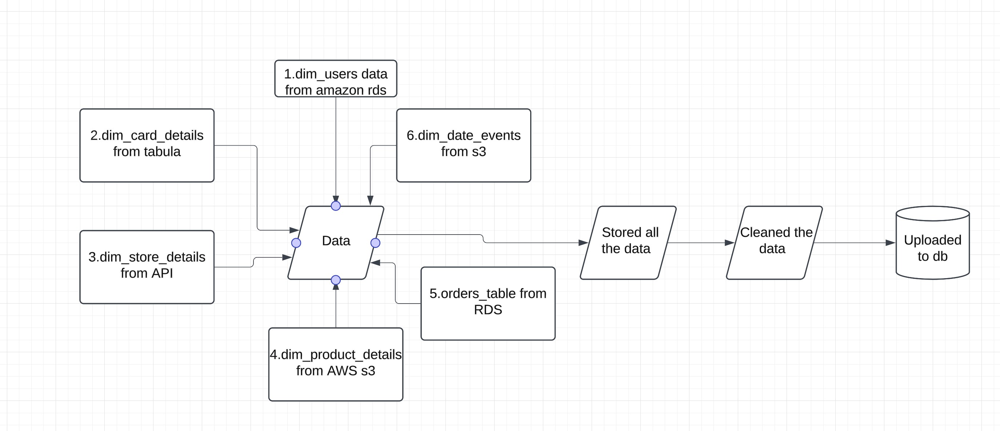
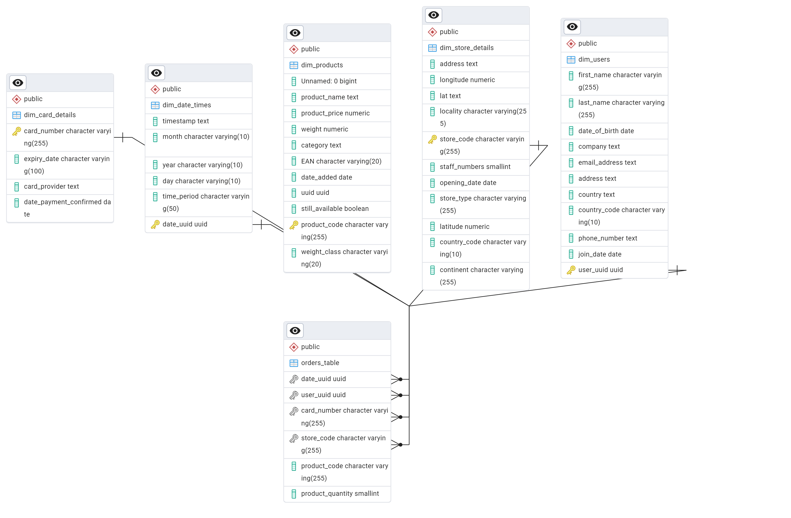

# Multinational Retail Data Centralisation

## Table of contents:
- Project Overview
- System Diagram (ERD)
- Dependencies
- How to Run the Project
- Usage

## Project Overview:
### Description:
This project aims to centralize the sales data of a multinational company that sells various goods worldwide. Currently, the sales data is scattered across multiple sources, making it difficult to access and analyze. The goal is to create a centralized database that serves as the single source of truth for all sales data, enabling efficient data access, up-to-date metrics, and data-driven decision-making.

### Objectives:
- Centralized Database: 
        Consolidate all sales data into a single, easily accessible location by uploading all the source data into the database.
- Single Source of Truth: 
        Eliminate inconsistencies and ensure reliable data for analysis and reporting.
- Data Accessibility: 
        Provide up-to-date metrics and insights for informed business decisions.

## System Diagram:
An Entity Relationship Diagram (ERD) will be created to represent the structure of the system and how data flows within it. The ERD will show the data extracted from different sources like:
- users_data from RDS
- Card_details from Tabula
- Store_details from API
- product_details from s3
- orders_data from RDS
- date_events from S3
ERD image:

## Dependencies:
- Python 3,
- Pandas
- SQLAlchemy
- PostgreSQL

## How to run the project:
1. Clone the repository using:
git clone https://github.com/padmasrivuppuluri/multinational-retail-data-centralisation199
2. Run main.py to extract the data and upload it to the database.
3. Run sales_data.sql/MIlestone3 to create the database schema.
4. Run sales_data.sql/Milestone4/Tasks.sql to query the data.

## Project structure:
### Milestone 1:
Set up the environment.

### Milestone 2: Extract and Clean the Data from Different Sources
This milestone consists of 3 Python files:
    - database_utils.py and data_extraction.py: Used to extract data from the database.
    - data_cleaning.py: Used to clean the data.
1. Install all the dependencies for Python, Pandas, and SQLAlchemy.
2. Extract data from different sources as mentioned in the System Diagram.
3. Clean the data and upload it to the database.

### Milestone 3: Create the database schema
    - Set up the PostgreSQL database and configure the database connection details in your project.
    - Cast the columns to their correct data types
    - Create primary and foreign keys to maintain data integrity.
ERD image:

### Milestone 4: Querying the data
Observe and analyze metrics by querying the centralized database.
 

